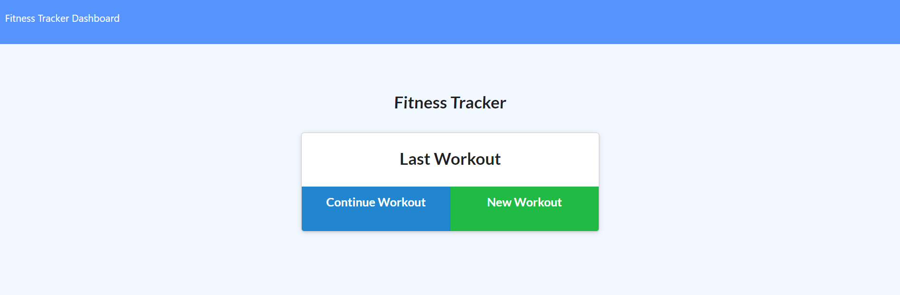
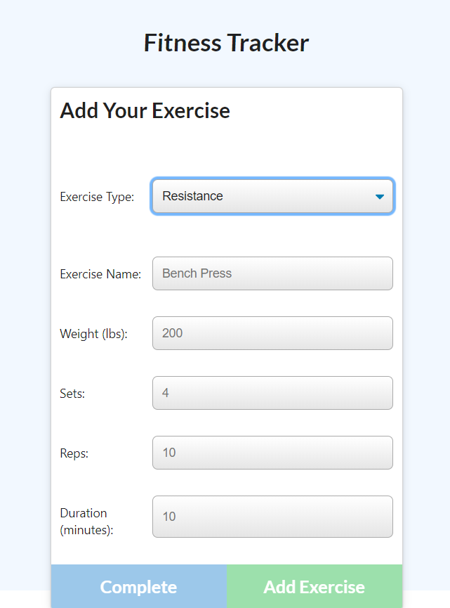

# Workout_Tracker

# Table of Contents
* [Description](#description)
* [User_Story](#user_story)
* [Links](#links)
* [Email_Address](#email_address)
* [Project_Images](#project_images)

# Description

App that allows you to create, view, and track daily workouts.

# User_Story

Getting into shape is a challenge for many, so to make starting and maintaining a routine is critical. Helping with that is the Workout Tracker! Keep your activities organized, and track your success on your way to a healthier lifestyle. 

# Links

https://jw-workout-tracker.herokuapp.com/

https://github.com/JoeWills615/Workout_Tracker

# Email_Address

JoeWills615@gmail.com

# Project_Images

 

   
   

  
  
   
   

 

   
   

  

   
   

  
